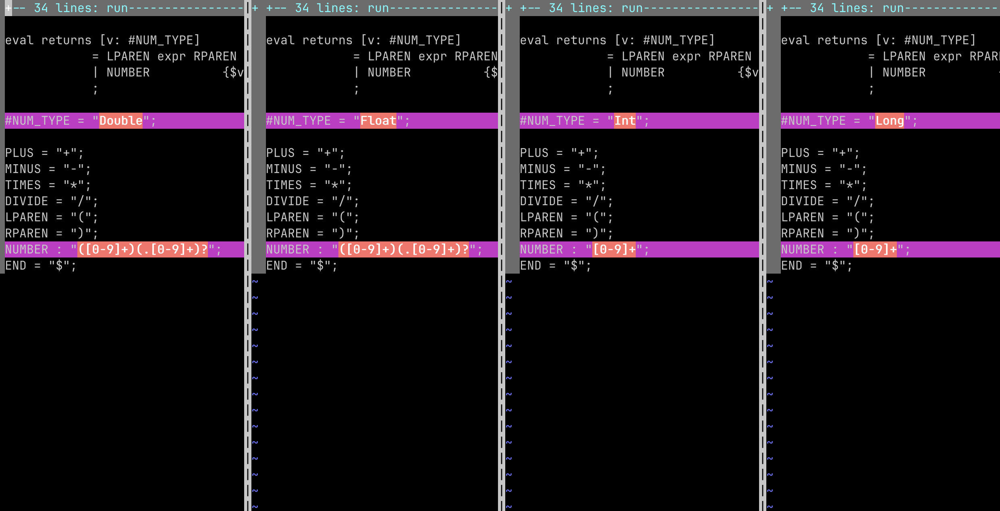

# LL(1) parser generator

## Реализовано:
- синтезируемые атрибуты
- наследуемые атрибуты
- LL(1) грамматики
- грамматика калькулятора - classic :)
- грамматика лабораторной 2 (Kotlin Variable Declaration)

### [Грамматика](./src/main/resources/KotlinDecl.txt)

## Выглядит страшно, но сейчас разберёмся
Вспоминаем грамматику лабы 2:
```
All -> Desc Cont
Cont -> Desc Cont
Cont -> ""
Desc -> Decl Value ";"
Value -> "=" num
Value -> ""
Decl -> V id ":" "Int"
V -> "var" | "val"
```

У нас:

```agsl
script

... imports

script returns [res : ListOfSource]
        = 
        ...
        desc(...)
        ...
        cont(...)
        END
        ;

cont [inc: ID, res: ListOfSource, parent: String]
        = EPS
        | ... 
        desc(...)
        ... 
        cont(...)
        END
        ;

desc [inc: ID, res: ListOfSource, parent: String]
        = ...
        decl(...)
        ...
        value(...)
        SEMICOLON
        ;

decl [inc: ID, res: ListOfSource, parent: String]
        = v(...)
        NAME ...
        COLON ...
        TYPE ...
        ;

v [inc: ID, res: ListOfSource, parent: String]
        = VAR ...
        | VAL ...
        ;

value [inc: ID, res: ListOfSource, parent: String]
        = EPS
        | EQ ...
        NUMBER ...
        ;
        
... TERMINALS
```

```
cont - имя нетерминала 
[inc: ID, res: ListOfSource, parent: String] - параметры нетерминала
= {inc!!.inc()} {res!!.add(node(parent).link(node("EPS")))} - управляющая конструкция
| {inc!!.inc()} {res!!.add(node(parent).link(node("DESC" + "\nid" + inc!!.value)))} - same
desc({inc}, {res}, {"DESC" + "\nid" + inc!!.value) - объявление нетерминала
{inc!!.inc()} {res!!.add(node(parent).link(node("CONT" + "\nid" + inc!!.value)))} - same
cont({inc}, {res}, {"CONT" + "\nid" + inc!!.value}) - same
;
```

## Правила грамматики
```
первая строка - имя корневого нетерминала
#import - импорты kotlin
остальное как в antlr (чтобы легче воспринимать)
```

Код в итоговых файлах хорошо отформатирован (возможно есть мелкие огрехи по типу двойных пробелов и т.д)
Node / Tree (в конце понял, что так не нужно указывать id, но хочется Kotlin GraphViz)

## Модификация
